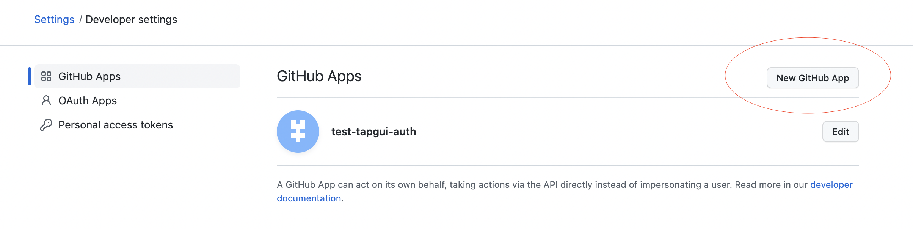
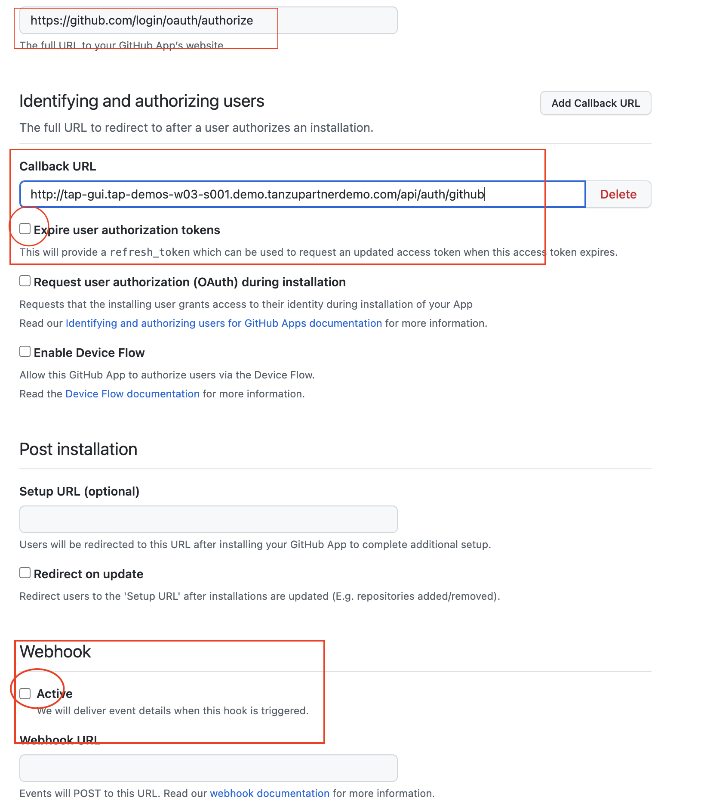
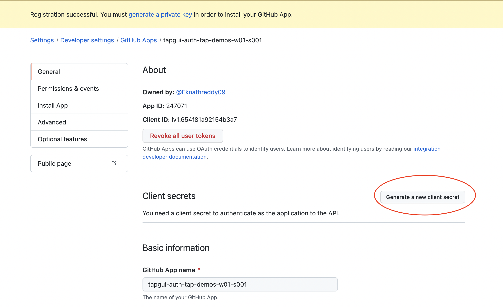
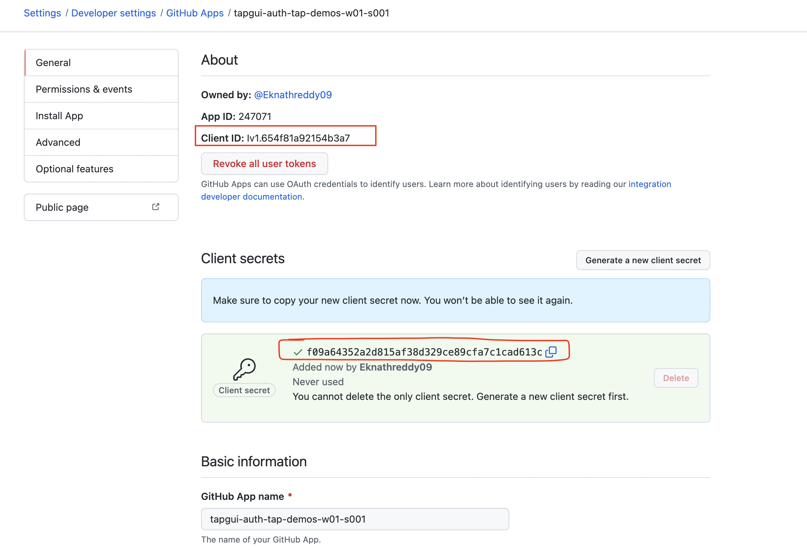

Login to GitHub by accessing below url: 

```dashboard:open-url
url: https://github.com/settings/apps
```

Click on New GitHub App



provide GitHub App name, for ex: tapgui-auth-{{ session_namespace }}

Homepage URL: https://github.com/login/oauth/authorize

Call back url: http://tap-gui.{{ session_namespace }}.demo.tanzupartnerdemo.com/api/auth/github

###### uncheck the Expire user authorization tokens under Callback URL

###### uncheck the Active box under Webhook



Create GitHubApp

Once registration is successful, create a new client secret using below steps: 



Copy the client ID and client secret into a notepad for later use. 


