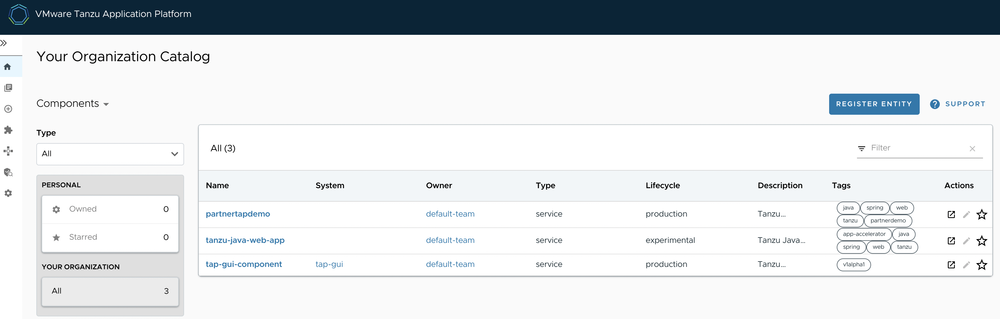

Tanzu Application Platform GUI is a tool for your developers to view your applications and services running for your organization. This portal provides a central location in which you can view dependencies, relationships, technical documentation, and the service status.
Tanzu Application Platform GUI consists of the following components:

Organization catalog

Tanzu Application Platform GUI plug-ins:

    Runtime Resources Visibility
  
    Application Live View
  
    Application Accelerator
  
    API Documentation
  
    Supply Chain Choreographer

TechDocs

###### In this section, lets see how to access TAP-GUI once installed with full profile. 

<p style="color:blue"><strong> Verify the pods in tap-gui namespace </strong></p>

```execute
kubectl get pods -n tap-gui
```

<p style="color:blue"><strong> Collect the load balancer IP </strong></p>

```execute
kubectl get svc envoy -n tanzu-system-ingress -o jsonpath='{.status.loadBalancer.ingress[0].ip}'
```

###### Add an entry in local host /etc/hosts path pointing the above collected load balancer IP with tap-gui.{{ session_namespace }}.demo.tanzupartnerdemo.com

Example for ref: 


<p style="color:blue"><strong> Access TAP GUI </strong></p>

```dashboard:open-url
url: http://tap-gui.{{ session_namespace }}.demo.tanzupartnerdemo.com
```

Example for ref: 



##### Integrate Auth (Github) with TAP GUI: 

Steps to create your own client ID, client secret in github: 

```dashboard:open-url
url: https://tap-gui.workshop.tap.tanzupartnerdemo.com/docs/default/component/tap-gui-component/github-settings/
```

Remove (#) from lines 67 - 73


Replace provideyourclientid

```editor:open-file
file: ~/tap-values.yaml
line: 72
```

Replace provideyourcliensecret

```editor:open-file
file: ~/tap-values.yaml
line: 73
```

```execute
sudo tanzu package installed update tap -f $HOME/tap-values.yaml -n tap-install
```

```dashboard:open-url
url: http://tap-gui.{{ session_namespace }}.demo.tanzupartnerdemo.com
```

Authenticate to TAP GUI portal with your github credentials. 
